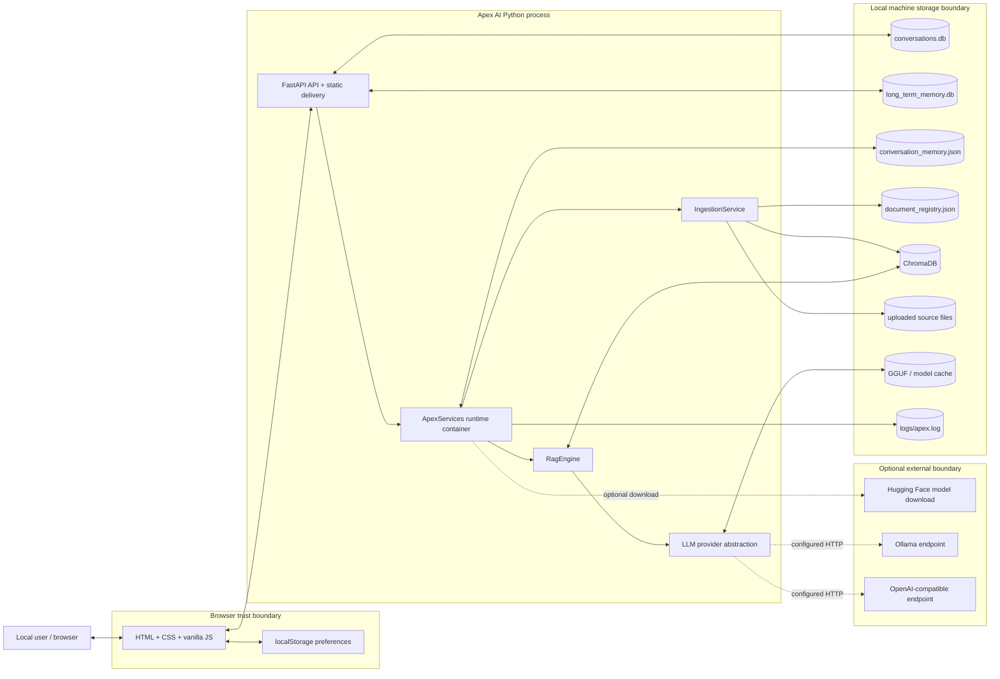
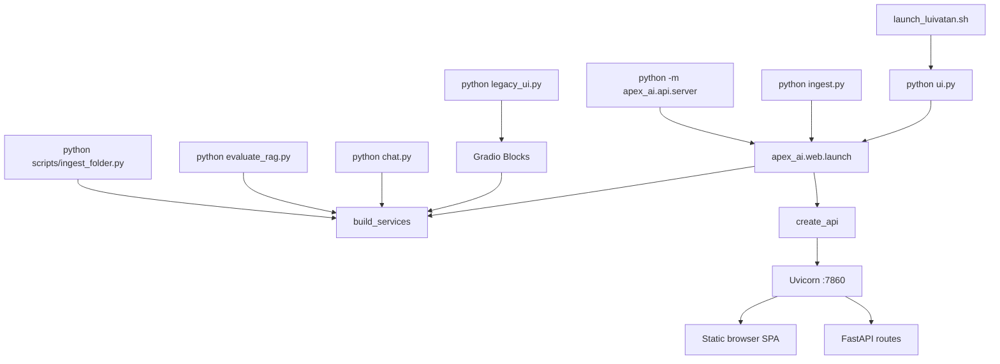
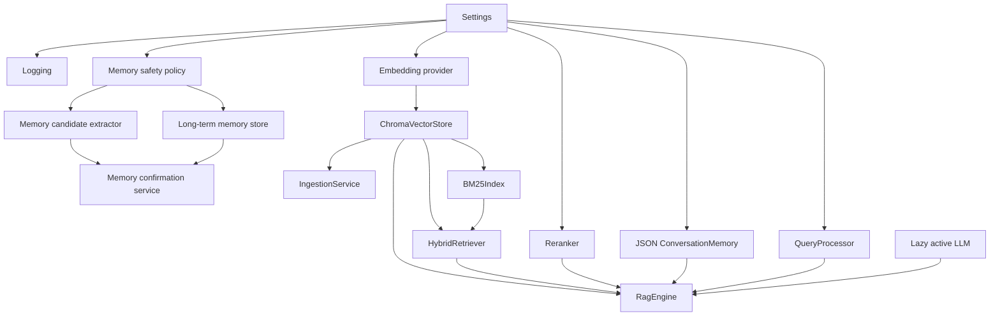
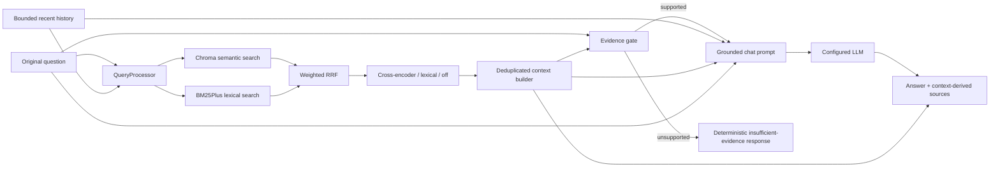
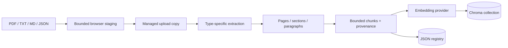

# Apex AI — Phase 2 Architecture Map

- **Date:** 2026-08-28 (America/Chicago)
- **Canonical code baseline:** `6d0d5cb` (`Add explicit memory confirmation workflow`)
- **Roadmap phase:** Phase 2 — Architecture Map
- **Change type:** Documentation only; no runtime behavior is changed by this phase

## 1. Scope and repository boundary

This document maps the architecture that is present in the repository. It does not
claim production readiness or describe planned components as if they already exist.

At the start of this phase, the local branch pointer was safely realigned with
`origin/arena/01a042f1-luivatan-ai` at `6d0d5cb` using a mixed reset. A byte-for-byte
manifest confirmed that this changed no working-tree file content. Uncommitted Phase 46
memory-management work remains preserved in the working tree and is deliberately not
part of this Phase 2 commit.

The canonical baseline includes memory candidate extraction, safety, and explicit
approval/rejection through Phase 45. Viewing/deleting/resetting confirmed memory is a
Phase 46 working-tree overlay and must not be treated as baseline functionality until it
is separately completed, fully tested, and committed.

## 2. Architectural status at a glance

| Concern | Current implementation | Boundary/status |
|---|---|---|
| Product mode | Single-user document RAG application | Local use only |
| Primary UI | Static HTML/CSS/vanilla JavaScript SPA | Served by FastAPI |
| Compatibility UI | Gradio Blocks | Separate launcher |
| API | FastAPI + Pydantic | Root-level, unversioned routes |
| Runtime | One in-process `ApexServices` container | Single process assumed |
| Generation | Pluggable `LLMProvider` | Local or configured remote endpoint |
| Embeddings | sentence-transformers provider | Loaded locally; optional initial download |
| Vector retrieval | ChromaDB persistent collection | One global collection |
| Lexical retrieval | In-memory BM25Plus | Rebuilt from Chroma after writes |
| Conversations | SQLite for browser chat | No user/project owner fields |
| Compatibility memory | JSON for CLI/Gradio/legacy `/query` | Separate from browser conversations |
| Long-term memory | Separate SQLite database | Confirmed records are not prompt context |
| Document bytes | Local upload directory | Separate from vector and registry state |
| Document registry | JSON file | Not transactional with Chroma/files |
| Authentication | Not implemented | Server must not be exposed to untrusted networks |
| Authorization/isolation | Not implemented | All data is global |
| Deployment | Direct Uvicorn/Gradio process | No production manifest |

## 3. System context and trust boundaries



### Trust-boundary facts

1. The browser and API are same-origin in the supported primary deployment.
2. There is no authenticated identity between browser and API.
3. The API binds to `0.0.0.0` by default, which is broader than the current trust model.
4. With `llama_cpp` or a local Transformers path, generation can remain on the machine.
5. With OpenAI-compatible generation, the question, bounded conversation context, and
   retrieved evidence leave the local process for the configured endpoint.
6. Ollama is local only when `APEX_OLLAMA_URL` actually points to a local service.
7. Hugging Face network access can occur when required models are not cached and explicit
   offline mode is not enabled.
8. Chroma, SQLite, JSON files, uploads, caches, and logs are not encrypted by Apex AI.
9. The long-term-memory safety policy does not sanitize ordinary conversations, source
   documents, citation excerpts, or debug logs.

## 4. Process and entry-point map



### Supported entry points

| Entry point | UI/transport | Conversation state used |
|---|---|---|
| `ui.py` | FastAPI browser application | SQLite `ConversationStore` |
| `ingest.py` | Alias of FastAPI browser application | SQLite `ConversationStore` |
| `apex_ai.api.server` | FastAPI browser application/API | SQLite browser routes plus JSON `/query` memory |
| `legacy_ui.py` | Gradio | JSON `ConversationMemory` |
| `chat.py` | Terminal | JSON `ConversationMemory` |
| `evaluate_rag.py` | Terminal/report file | Explicit evaluation history; normal memory writes disabled where intended |
| `scripts/ingest_folder.py` | Terminal | No conversation state |

The two conversation persistence paths are a current architectural split, not two views
of one store.

## 5. Primary browser frontend

### Framework and delivery

- Framework: no client framework; HTML5, CSS, and vanilla JavaScript.
- HTML shell: `apex_ai/web/templates/index.html`.
- Styles: `apex_ai/web/static/app.css`.
- Behavior/state/API client: `apex_ai/web/static/app.js`.
- Delivery: FastAPI `FileResponse` for `/` and `StaticFiles` under `/assets`.
- Build step: none.
- External frontend assets: none for the product UI.

### Views and components

```text
Application shell
├── Conversation sidebar
│   ├── New chat
│   ├── Search
│   ├── Open / rename / delete
│   └── Documents / Settings navigation
├── Chat view
│   ├── Welcome suggestions
│   ├── User and assistant messages
│   ├── Streamed Markdown output
│   ├── Citation chips
│   ├── Attachment tray
│   └── Multiline send/stop composer
├── Documents view
│   ├── Drop zone / file picker
│   ├── Indexed-document list
│   └── Re-index / delete controls
├── Settings view
│   ├── Theme
│   ├── Enter-to-send / auto-scroll / conversation context
│   ├── Backend status
│   └── Local conversation deletion
├── Source drawer
├── Confirmation modal
└── Toast region
```

Phase 45 also supplies memory-confirmation cards near the composer. Phase 46's confirmed
memory management panel exists only in the preserved working-tree overlay.

### Frontend state ownership

| State | Location | Persistence |
|---|---|---|
| Active conversation/messages | JavaScript `state` | Reloaded from API |
| Conversation list | JavaScript `state` | SQLite is authoritative |
| Pending attachments | JavaScript `state` | Ephemeral until uploaded |
| Stream/request state | JavaScript `state` | Ephemeral |
| Pending memory candidates | JavaScript `state` | Long-term-memory SQLite is authoritative |
| Theme/chat preferences | `localStorage` | Per browser profile |
| Models/config/documents | JavaScript `state` | Reloaded from API |

### Browser/API protocol

Ordinary calls use a shared `api()` wrapper around same-origin `fetch`. Chat generation
uses `POST /chat/stream` and consumes newline-delimited JSON:

```text
meta -> zero or more token events -> final
                               \-> stopped
                               \-> error
```

Model and user text is escaped before the allowlisted Markdown renderer introduces its
own HTML. Source text and most dynamic labels use DOM text nodes.

## 6. API map

### Runtime and model routes

| Method/path | Responsibility | Main dependency |
|---|---|---|
| `GET /health` | Combined runtime status | `ApexServices` |
| `GET /app-config` | Browser-safe runtime summary | Settings/ingestion |
| `GET /models` | Discover local GGUF files | `ModelManager` |
| `POST /models/select` | Select a validated GGUF for this process | `ApexServices.select_model` |

### Document routes

| Method/path | Responsibility | Main dependency |
|---|---|---|
| `GET /documents` | List JSON registry records | `IngestionService` |
| `POST /documents/upload` | Bounded multipart browser upload | Upload adapter + ingestion |
| `POST /documents/ingest` | Ingest a server-local path | `IngestionService` |
| `POST /documents/{id}/reindex` | Reprocess a registered source | `IngestionService` |
| `DELETE /documents/{id}` | Delete vectors and registry record | `IngestionService` |

`POST /documents/ingest` is an automation compatibility route, but without authentication
it is unsafe on an untrusted network because callers can name process-readable paths.

### Chat and conversation routes

| Method/path | Responsibility | Persistence |
|---|---|---|
| `POST /query` | Compatibility non-streaming RAG request | JSON memory |
| `POST /chat/stream` | Browser conversation + NDJSON generation | SQLite conversations |
| `POST /chat/stop` | Cooperative cancellation flag | Process memory |
| `GET /conversations` | List/search conversations | SQLite |
| `POST /conversations` | Create conversation | SQLite |
| `GET /conversations/{id}` | Load conversation/messages | SQLite |
| `PATCH /conversations/{id}` | Rename conversation | SQLite |
| `DELETE /conversations/{id}` | Delete conversation/messages | SQLite |
| `DELETE /conversations` | Delete every conversation/message | SQLite |

### Long-term-memory routes at Phase 45 baseline

| Method/path | Responsibility |
|---|---|
| `GET /memory/candidates` | List unexpired safe pending proposals |
| `POST /memory/candidates/{id}/approve` | Atomically confirm a proposal |
| `POST /memory/candidates/{id}/reject` | Remove pending content and retain a tombstone |

The Phase 46 overlay adds list/delete/reset operations for confirmed memories; they are
not included in this baseline map as completed behavior.

### Developer route

`POST /debug/rag` exists only when `APEX_RAG_DEBUG=1`, is omitted from OpenAPI, and has no
normal UI link. It exposes sensitive retrieval/context detail and remains unauthenticated
when enabled, so it is suitable only inside the current trusted local boundary.

## 7. Runtime composition

`apex_ai/runtime.py` is the composition root:



Long-term memory is initialized behind an optional-component boundary. Its failure does
not disable document chat. Core service construction captures expected startup failures
so the browser can display a configuration message rather than terminate immediately.

`services.ready` currently means that a vector store and RAG engine exist. It does not
mean that a generation provider has successfully loaded or that a configured remote
provider is reachable.

## 8. LLM and embedding architecture

### Generation provider interface

Every generation backend implements:

- `generate(...) -> str`
- `stream(...) -> Iterator[str]` (native or base fallback)
- `get_model_info()`
- optional `validate()`

| Provider key | Implementation | Location/data egress | Streaming |
|---|---|---|---|
| `llama_cpp` | `LocalLLMProvider` | Local GGUF | Yes |
| `ollama` | `OllamaProvider` | Configured `/api/chat` endpoint | Yes |
| `openai` | `OpenAICompatProvider` | Configured `/chat/completions` endpoint | Yes |
| `openai_compatible` | Same compatible provider | Configured endpoint | Yes |
| `transformers` | `TransformersProvider` | Local/cache or possible model download | Base single-shot fallback |

The provider object is lazy and globally cached by relevant settings. Model selection
changes the in-memory settings snapshot and resets this provider cache; selection is not
persisted to `.env`.

### Embeddings

`SentenceTransformerProvider` is independent from the answer model. It loads
`all-MiniLM-L6-v2` by default, normalizes vectors, and records model identity and vector
dimension in Chroma metadata. It first attempts cache-only loading and may perform a
one-time download unless explicit offline behavior blocks it.

`HashingEmbeddingProvider` is a deterministic test/evaluation mechanism. It is not a
production semantic model and is never selected automatically by the app.

## 9. RAG component and request map



### Retrieval invariants

1. The original question remains the first retrieval query.
2. Conversation history can clarify a follow-up but is not documentary evidence.
3. Semantic and lexical scores are not directly added; their rankings are fused by RRF.
4. One failed retrieval channel may degrade to the other.
5. Optional reranking may degrade to lexical or fused order.
6. Only chunks that fit the final context may become source records.
7. Weak/no evidence returns a fixed refusal without invoking the answer model.
8. Confirmed long-term memory is not part of retrieval or prompts at this phase.

### Generation context

The engine builds two chat messages:

- A system message containing grounding rules and optional medical caution.
- A user message containing bounded history, numbered evidence blocks, and the original
  question.

The context-window calculation uses a documented four-characters-per-token
approximation. Exact provider-tokenizer fit is not guaranteed by this architecture.

## 10. Document ingestion architecture



### Type behavior

| Type | Extraction | Provenance/limitations |
|---|---|---|
| PDF | pypdf text layer by page | Preserves page numbers; no built-in OCR/layout model |
| TXT | UTF-8 with replacement | One logical page |
| Markdown | Text extraction with heading heuristics | One logical page |
| JSON | Recursive string-leaf collection | Numbers/booleans and much structure are omitted |

Browser uploads are extension checked, filename sanitized, staged under a random UUID,
and bounded by `APEX_MAX_UPLOAD_MB`. Local-path and batch ingestion do not share the
browser size boundary.

### Persistence order and current consistency boundary

Current ingestion updates local files, Chroma, and the JSON registry as separate steps.
There is no transaction spanning them. The registry must therefore be treated as a UI
catalog rather than an independently authoritative proof of vector/file consistency.

The managed source file is required for re-indexing. Current deletion removes vectors
and the registry record but does not unlink that managed source file.

## 11. Persistent data map

| Data | Default path/location | Writer | Reader | Canonical purpose |
|---|---|---|---|---|
| Source files | `data/uploads/` | `IngestionService` | extraction/re-index | Managed original bytes |
| Document registry | `data/document_registry.json` | `IngestionService` | document UI/API | Rich document catalog |
| Vectors/chunks | `data/chroma/`, collection `apex_docs` | `ChromaVectorStore` | semantic/BM25/RAG | Retrieval evidence |
| Browser conversations | `data/conversations.db` | `ConversationStore` | browser chat | Primary web conversation history |
| Compatibility memory | `data/conversation_memory.json` | `ConversationMemory` | CLI/Gradio/`/query` | Legacy bounded turn memory |
| Long-term memory | `data/long_term_memory.db` | `LongTermMemoryStore` | confirmation API | Pending decisions and confirmed memory |
| Model cache | `data/cache/` | model libraries | embedding/reranker | Reusable local models |
| GGUF models | `models/` or configured path | user | llama.cpp provider | Local generation weights |
| Logs | `logs/apex.log` | logging subsystem | operator | Rotating diagnostics |
| UI preferences | browser `localStorage` | browser JS | browser JS | Device/browser behavior only |
| Evaluation reports | `eval/reports/` | evaluation runner | developer | Local measured run artifacts |

### SQLite schemas

#### Browser conversations

```text
conversations
- id TEXT PRIMARY KEY
- title TEXT NOT NULL
- created_at TEXT NOT NULL
- updated_at TEXT NOT NULL

messages
- id TEXT PRIMARY KEY
- conversation_id TEXT NOT NULL -> conversations(id) ON DELETE CASCADE
- role TEXT CHECK user|assistant
- content TEXT NOT NULL
- citations_json TEXT NOT NULL
- status TEXT CHECK complete|stopped|error
- created_at TEXT NOT NULL
```

#### Long-term memory

```text
long_term_memories
- id TEXT PRIMARY KEY
- kind TEXT CHECK preference|ongoing_context
- content TEXT NOT NULL
- created_at TEXT NOT NULL
- updated_at TEXT NOT NULL

pending_memories
- id TEXT PRIMARY KEY
- kind TEXT CHECK preference|ongoing_context
- content TEXT NOT NULL
- rule TEXT NOT NULL
- created_at TEXT NOT NULL
- expires_at TEXT NOT NULL

memory_candidate_decisions
- candidate_id TEXT PRIMARY KEY
- decision TEXT CHECK approved|rejected
- memory_id TEXT nullable
- decided_at TEXT NOT NULL
```

No current persistent schema contains `user_id`, `owner_id`, `tenant_id`, `project_id`,
collection access, subscription, entitlement, or usage-accounting fields.

## 12. Short-term and long-term memory boundaries

### Browser short-term context

The SQLite adapter pairs persisted browser messages into recent turns. The context
builder then keeps a contiguous window of newest complete turns under configured turn,
per-message, and total-character limits. Old citation markers and generated source
footers are stripped before a previous answer becomes context.

### Compatibility short-term context

CLI, Gradio, and `/query` use a separate bounded JSON list. Clearing this file does not
clear browser conversations, and deleting browser conversations does not clear this
file.

### Long-term memory

The Phase 45 path is:

```text
explicitly worded user message
  -> deterministic candidate extraction
  -> fail-closed safety policy
  -> expiring pending record
  -> explicit Remember / Don't save decision
  -> confirmed memory or content-free decision tombstone
```

Only browser streaming chat proposes candidates. Confirmed records do not enter answer
prompts. Relevant memory retrieval belongs to later roadmap work and must not be
simulated before it exists.

## 13. Security architecture

### Existing controls

- `.env` and common runtime/model paths are ignored.
- Active Apex provider secrets are read from environment/configuration.
- Upload filenames are normalized and path traversal is blocked.
- Browser upload bytes are streamed and size bounded.
- SQLite statements use parameters.
- Product UI output is escaped before limited Markdown rendering.
- CSP, `nosniff`, referrer, and permissions headers are applied.
- The normal UI has no remote scripts or assets.
- The RAG debug route is absent unless explicitly enabled.
- Long-term-memory safety findings return reason codes, not matched values.

### Absent controls

- Authentication and sessions
- Backend authorization
- User/project isolation
- API keys for inbound clients
- Rate limiting and quotas
- Trusted host validation
- TLS/HSTS configuration
- Explicit clickjacking protection (`frame-ancestors` or equivalent)
- Encryption at rest
- Production secret manager integration
- Audit events tied to authenticated actors
- Malware/content scanning
- History-aware committed-secret verification in this repaired checkout

### Current exposure rule

Until roadmap authentication, authorization, and isolation phases are completed and
tested, Apex AI is a trusted single-user local application. It must not be presented as
safe for an untrusted LAN or public internet deployment merely because browser CORS
blocks some cross-origin JavaScript.

## 14. Deployment map

### Current supported topology

```text
One machine
└── one Python process
    ├── Uvicorn + FastAPI + static assets
    ├── embeddings and optional local LLM in memory
    ├── in-memory BM25 and generation manager
    └── one local filesystem
        ├── Chroma
        ├── SQLite files
        ├── JSON files
        ├── uploads/models/cache
        └── logs
```

### Not present

The repository has no Dockerfile, Compose file, Procfile, package manifest, reverse
proxy, TLS setup, process supervisor, migration runner, backup job, monitoring, error
tracking, or cloud deployment manifest. (A CI workflow now exists as of Phase 9 —
see section 19 — but it only runs tests/lint; it is not a deployment pipeline.)

### Scaling constraints

The architecture must not be scaled to multiple workers/instances without redesigning or
validating:

- Process-local generation reservations
- Shared local model concurrency
- Process-local BM25 invalidation
- JSON document-registry writes
- File/Chroma/registry update ordering
- SQLite and Chroma access across processes
- Shared persistent-volume and backup semantics

## 15. Failure and degradation map

| Failure | Current behavior |
|---|---|
| Long-term-memory store fails | Core document chat continues; memory confirmation unavailable |
| Cross-encoder unavailable | Falls back to lexical reranking |
| Semantic retrieval fails | BM25 may continue |
| BM25 fails | Semantic retrieval may continue |
| Context construction fails | Turn is refused rather than generated without evidence |
| Weak/no evidence | Deterministic refusal, no LLM call |
| Missing embedding model | Core service startup reports an actionable error |
| Missing generation model | Service may report ready; generation later reports provider/model error |
| Browser upload failure | Staging is removed; a managed copy may remain if failure occurred later |
| Corrupt JSON conversation memory | File is moved to a backup when possible |
| Corrupt document registry | Registry is abandoned in memory; Chroma reconciliation is not automatic |
| Browser disconnect/stop | Partial text may be persisted as `stopped` |

## 16. Architectural invariants to preserve

Future phases should preserve these proven boundaries unless a measured defect requires a
controlled replacement:

1. Keep ChromaDB unless evidence demonstrates that it cannot meet requirements.
2. Keep generation behind `LLMProvider`; do not hardwire one model/vendor.
3. Keep embeddings independently configurable from the generation model.
4. Preserve the original query and exact names, numbers, dates, IDs, and abbreviations.
5. Keep conversation and long-term memory separate from documentary evidence.
6. Never turn memory into a citation source.
7. Create source metadata only from chunks that actually entered model context.
8. Refuse unsupported questions without generating a fabricated answer.
9. Keep offline local generation and retrieval viable.
10. Let optional retrievers/rerankers/memory fail without taking down core chat.
11. Preserve public entry-point shims until compatibility tests justify a change.
12. Keep developer RAG internals out of normal user responses.
13. Do not silently migrate or destroy existing indexes, uploads, conversations, or
    memories.
14. Do not represent remote execution as local/private.
15. Do not add production scale, billing, or user claims before those systems exist and
    are tested.

## 17. Known architecture gaps to resolve in later phases

These are mapped facts, not Phase 2 implementation work:

1. No inbound identity, authentication, authorization, or ownership model.
2. Default all-interface binding conflicts with the local-only trust boundary.
3. Local-path ingestion and model/path disclosures are unprotected.
4. Provider readiness and privacy are not represented accurately in the UI/health API.
5. Browser SQLite history and compatibility JSON memory are divergent stores.
6. Document files, registry, and vectors lack transactional/recoverable coordination.
7. Managed source files remain after document deletion.
8. Heavy ingestion runs synchronously in an async request handler.
9. Every context source is attached even when the generated answer does not reference it;
   marker/claim validity is measured only by evaluation, not enforced live.
10. Configuration values are not comprehensively range/combo validated.
11. Optional provider and utility dependencies are not separated or fully declared.
12. No install lock, CI, migrations, backup, deployment, or monitoring architecture exists.
13. Real-model quality, hardware performance, concurrency safety, and large-corpus behavior
    remain unverified.

## 18. Verification status

Phase 2 changes documentation only. During the preceding audit:

- 89 Python files parsed successfully with the standard-library AST parser.
- `apex_ai/web/static/app.js` passed `node --check`.
- Remote Phase 45's recorded full suite result is `192 passed, 3 warnings`.
- The preserved Phase 46 overlay's recorded focused result is `68 passed, 1 warning`.

The current machine has no `.venv` and no project/test dependencies installed. Therefore,
a current full pytest run and live application startup are **UNKNOWN**. Before any runtime
phase is accepted, create a clean environment, resolve dependencies, run the complete
offline suite, and record the exact command/result. Real-model and browser-device checks
remain separate from deterministic unit/integration tests.

## 19. Amendments after later phases

This map is pinned to its Phase 2 baseline (`6d0d5cb`) on purpose — it is a snapshot,
not a living document — but a few of its facts have since been superseded by
completed, tested phases. Rather than silently let those go stale, they're corrected
here with a pointer to the phase that changed them:

| Section 17/section 6 claim at Phase 2 | Current reality | Changed by |
|---|---|---|
| "No install lock, CI, migrations, backup, deployment, or monitoring architecture exists" | `.github/workflows/tests.yml` runs the full offline suite plus Ruff on every push/PR; `pyproject.toml` gives pytest real configuration | Phase 9 |
| "Provider readiness and privacy are not represented accurately in the UI/health API" | `/health` now live-probes the vector store on every request (not just startup state) and returns `503` when that check fails; it also reports `llm.configured` with an explicit note that connectivity is *not* verified there (still true — see that phase's stated boundary) | Phase 8 |
| `GET /health` row in the section 6 API map ("Combined runtime status") | Also returns `database` and `llm` component objects; every route in the API now declares a `response_model` (`apex_ai/api/schemas.py`) so `/openapi.json` documents real response shapes instead of bare dicts | Phases 7–8 |
| Section 4's "current machine has no `.venv`... a current full pytest run... is UNKNOWN" | Resolved for CI (see above); a contributor's local environment is still their own responsibility — see [`CONTRIBUTING.md`](../CONTRIBUTING.md) | Phase 9 |

Everything else in this document — the component/trust-boundary maps, data schemas,
security posture, deployment topology, and the architectural invariants in section
16 — remained accurate as of Phase 9 and is not restated in Phase 7/8/9's own docs;
read those alongside this map, not instead of it.

## 20. Phase 2 conclusion

Apex AI currently has a coherent modular single-process RAG core and a same-origin
chat-first browser application. Its supported trust boundary is one trusted local user on
one machine. Chroma is the evidence store, SQLite is the browser-conversation and
long-term-memory storage technology, local files retain originals/configured models, and
optional providers may cross an external network boundary.

This map does not authorize new feature work. The next safe work is foundation closure:
validate configuration and provider boundaries, make dependencies reproducible, harden
errors/logging/health/API exposure, and establish a clean full-suite gate before resuming
later memory or production roadmap phases.
